# Booktine

> 독서 기록, 목표, 통계, 추천, 커뮤니티를 한 곳에서 관리하는 독서 습관 관리 서비스

  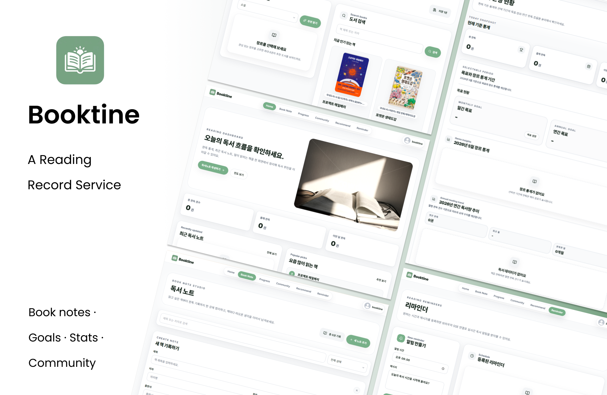

#### 🔗 서비스 : https://booktine.cloud
> 서비스 운영 기간: 2026.05 ~ 2027.05

#### ⭐ 블로그 : [프로젝트 기술 블로그](https://dev-cloud.tistory.com/category/%F0%9F%92%BB%20PROJECT/%5BSpring%20Boot%2C%20React%5D%20%EB%8F%85%EC%84%9C%20%EC%8A%B5%EA%B4%80%20%EA%B4%80%EB%A6%AC%20%EC%84%9C%EB%B9%84%EC%8A%A4)

 

## 목차

[프로젝트 소개](#프로젝트-소개) · [기술 스택](#기술-스택) · [주요 기능](#주요-기능) · [시스템 아키텍처](#시스템-아키텍처) · [ERD](#erd) · [트러블슈팅](#트러블슈팅) · [리팩토링](#리팩토링) · [프로젝트 후기](#프로젝트-후기)

 

## 프로젝트 소개

독서 기록이 메모 앱, 노트, 사진 등 여러 곳에 흩어져 장기적으로 관리하기 어렵다는 문제에서 출발했습니다.
Booktine은 읽은 책의 기록과 메모, 월간·연간 독서 목표, 통계 시각화, 도서 추천, 독서 커뮤니티까지 하나의 서비스에서 제공합니다.

### 서비스 목표
- 가입자 수 100명 달성
- 독서 기록 게시물 500건 이상
- 서비스 업타임 99% 이상 유지
- 2026.05 ~ 2027.05 1년간 안정적 운영

### 개발 기간
| 구분        | 기간                    |
|-----------|-----------------------|
| **1차 개발** | 2025.02.28 ~ 2025.05.01 |
| **2차 개발** | 2026.04.27 ~ 2026.05.11 |
| **유지 보수** | 2026.05.11 ~ 서비스 종료까지 |

 

## 기술 스택

### Backend
| 구분 | 기술 |
|------|------|
| Language | Java 21 (GraalVM) |
| Framework | Spring Boot 3.3, Spring Security 6 |
| Persistence | Spring Data JPA, MySQL 8, H2 (dev) |
| Auth | JWT, Redis, OAuth2 (Google), BCrypt |
| Storage / External | AWS S3, Aladin API, SMTP |
| API Docs | springdoc-openapi / Swagger UI (dev only) |
| Build | Gradle |

### Frontend
| 구분 | 기술 |
|------|------|
| Language | TypeScript |
| Framework | React 18, Vite |
| Styling | Tailwind CSS v3, shadcn/ui, CSS Variables |
| HTTP | Axios (Bearer Token Interceptor) |
| UI | lucide-react, framer-motion |

### Infra
| 구분 | 기술 |
|------|------|
| Compute | AWS EC2, Docker, Docker Hub |
| Database | AWS RDS (MySQL 8) |
| Cache | AWS ElastiCache (Redis) |
| Storage / CDN | AWS S3, CloudFront |
| Network | ALB, HTTPS (booktine.cloud / api.booktine.cloud) |

 

## 주요 기능

### 인증 / 회원 관리
<table>
  <tr>
    <td align="center">
      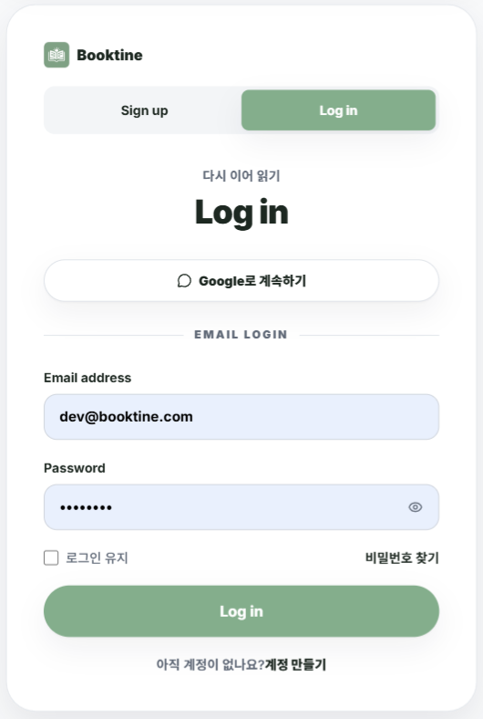 
      로그인
    </td>
    <td align="center">
      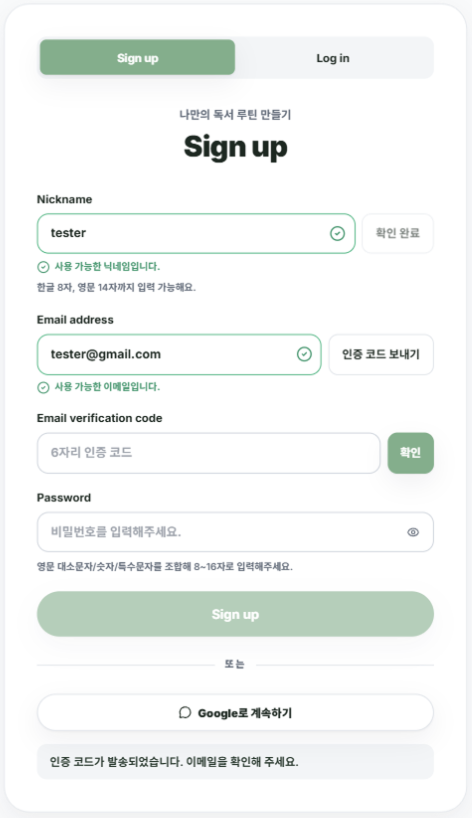 
      회원가입
    </td>
  </tr>
</table>

이메일 회원가입 및 이메일 인증, Google OAuth2 소셜 로그인을 지원합니다. JWT Access Token + Refresh Token 기반 인증과 Redis를 활용한 토큰 재발급 및 무효화, 비밀번호 재설정 기능을 제공합니다.

### 독서 기록 (Book Note)
<table>
  <tr>
    <td align="center">
      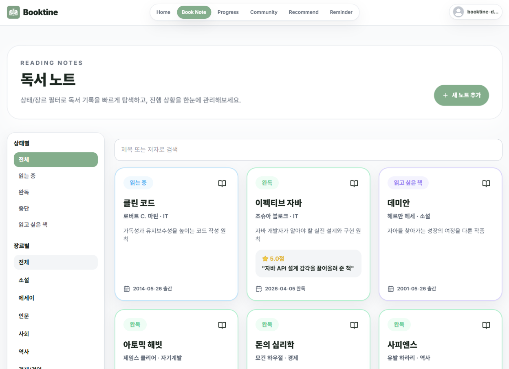 
      독서 기록 목록 화면
    </td>
    <td align="center">
      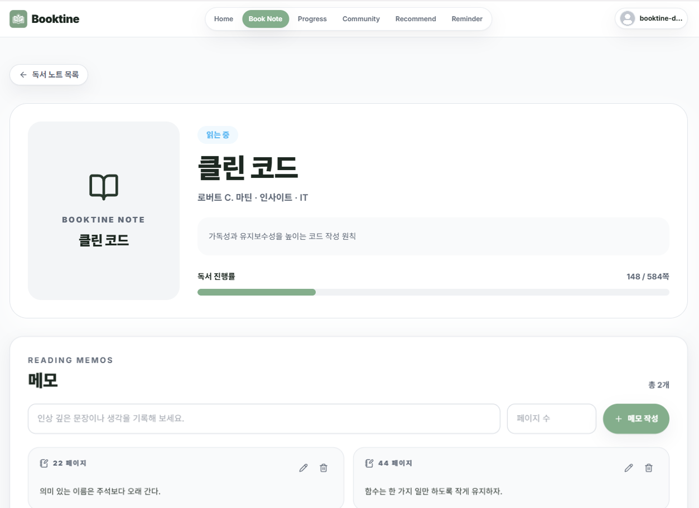 
      독서 기록 상세 화면
    </td>
  </tr>
</table>

도서 기록 CRUD와 독서 상태(읽는 중 / 완독 / 일시정지 / 읽고 싶음) 관리, 별점·한줄평·장르 기반 독서 노트를 작성할 수 있습니다.

### 목표 및 통계 (Progress)
<table>
  <tr>
    <td align="center">
      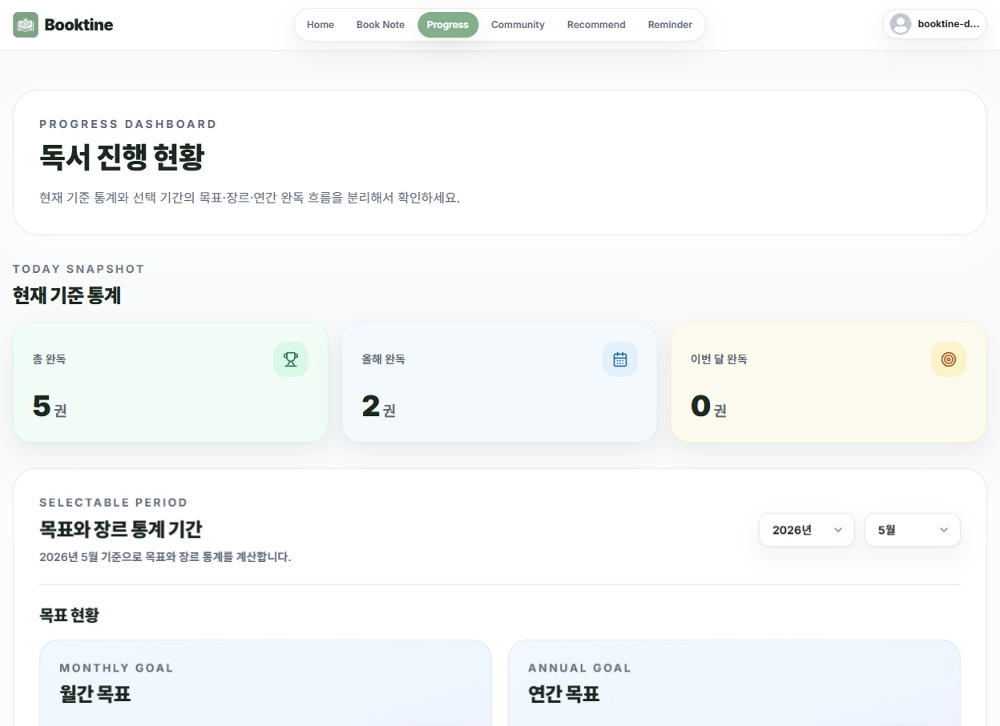 
      월간/연간 목표 카드
    </td>
    <td align="center">
      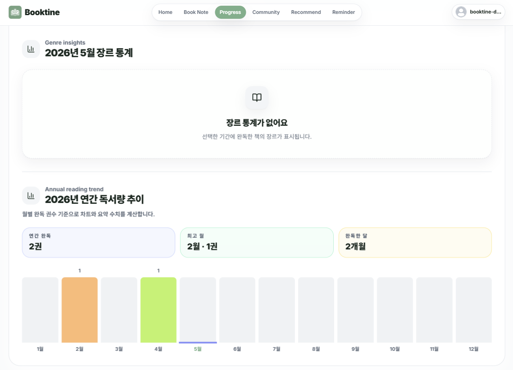 
      통계 차트
    </td>
  </tr>
</table>

월간·연간 독서 목표를 설정하고, 기본 통계, 장르별 분포, 연간 월별 완독 권수, 연간 완독 요약을 시각화하여 제공합니다.

### 도서 추천 (Recommendation)
<table>
  <tr>
    <td align="center">
      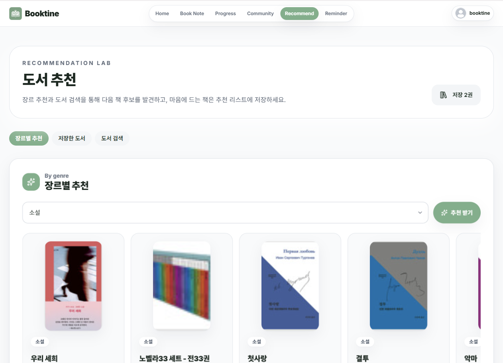 
      베스트셀러
    </td>
    <td align="center">
       
      장르별 추천
    </td>
    <td align="center">
      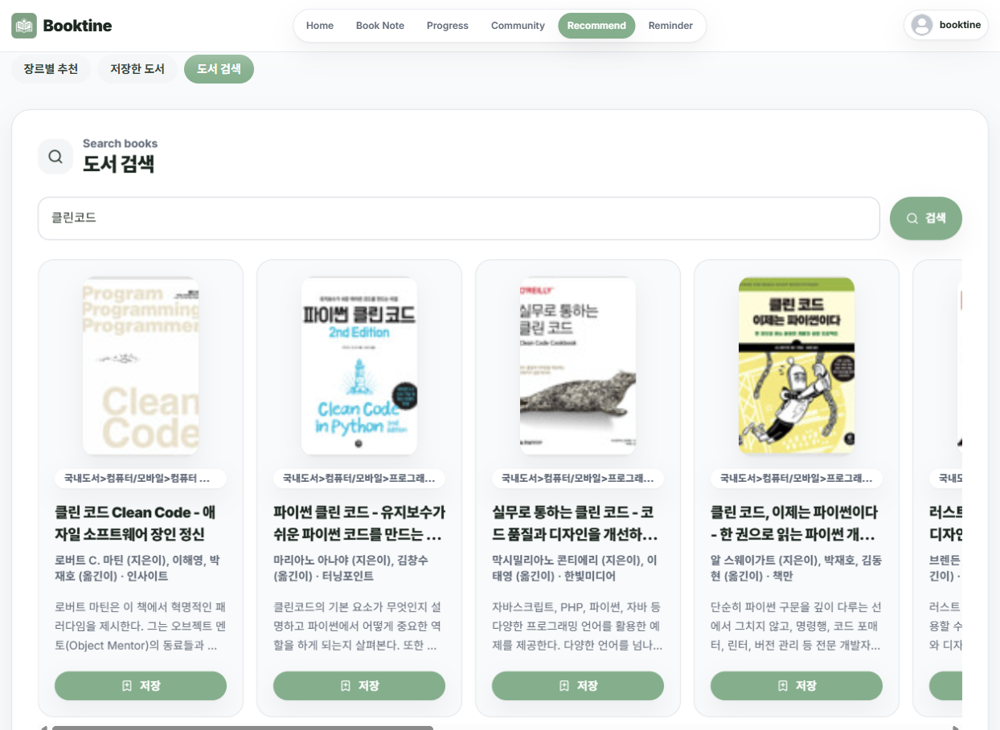 
      도서 검색
    </td>
  </tr>
</table>

Aladin API를 연동해 도서 검색, 베스트셀러 조회, 장르 기반 추천을 제공합니다. 추천받은 도서를 저장하고 목록으로 관리할 수 있습니다.

### 독서 커뮤니티
<table>
  <tr>
    <td align="center">
      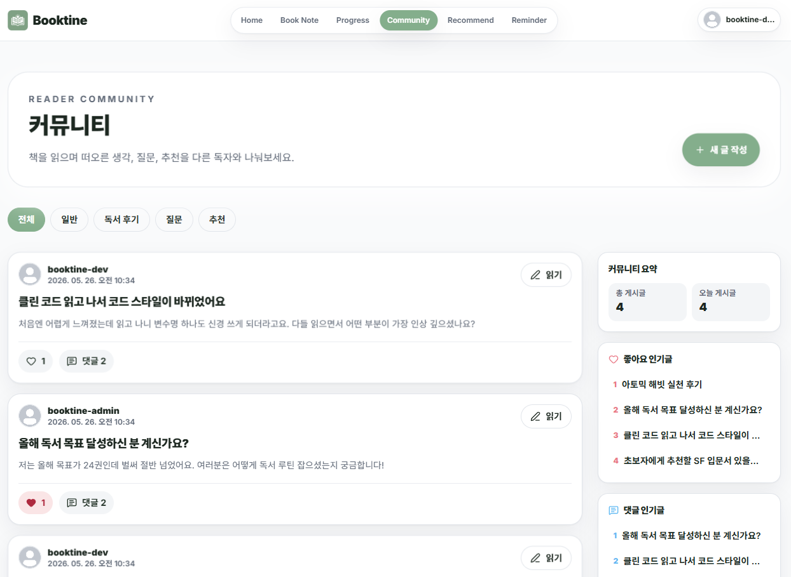 
      커뮤니티 목록
    </td>
    <td align="center">
      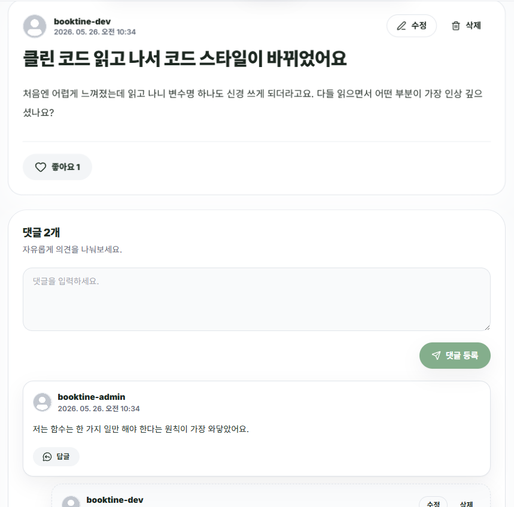 
      커뮤니티 상세 글
    </td>
  </tr>
</table>

커뮤니티 게시글 작성·수정·삭제와 댓글, 대댓글, 좋아요 기능을 지원합니다.

### 리마인더
<table>
  <tr>
    <td align="center">
      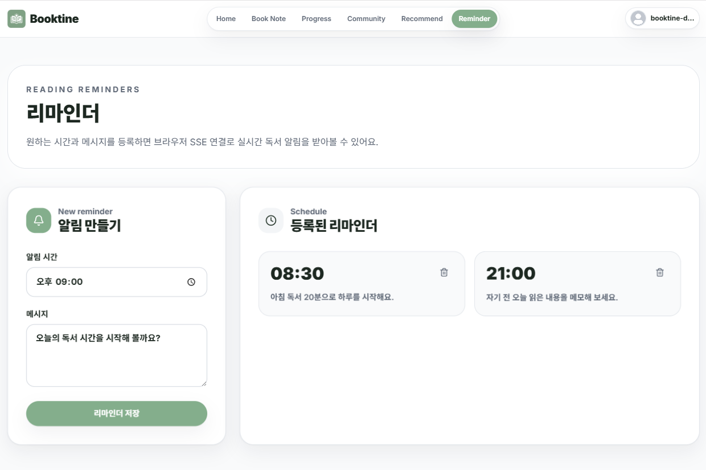 
      리마인더
    </td>
    <td align="center">
      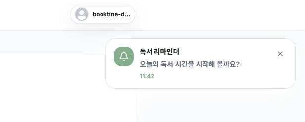 
      알림 수신
    </td>
  </tr>
</table>

독서 리마인더를 등록하고 SSE 연결을 통해 실시간 알림을 수신할 수 있습니다.

### 관리자
<table>
  <tr>
    <td align="center">
      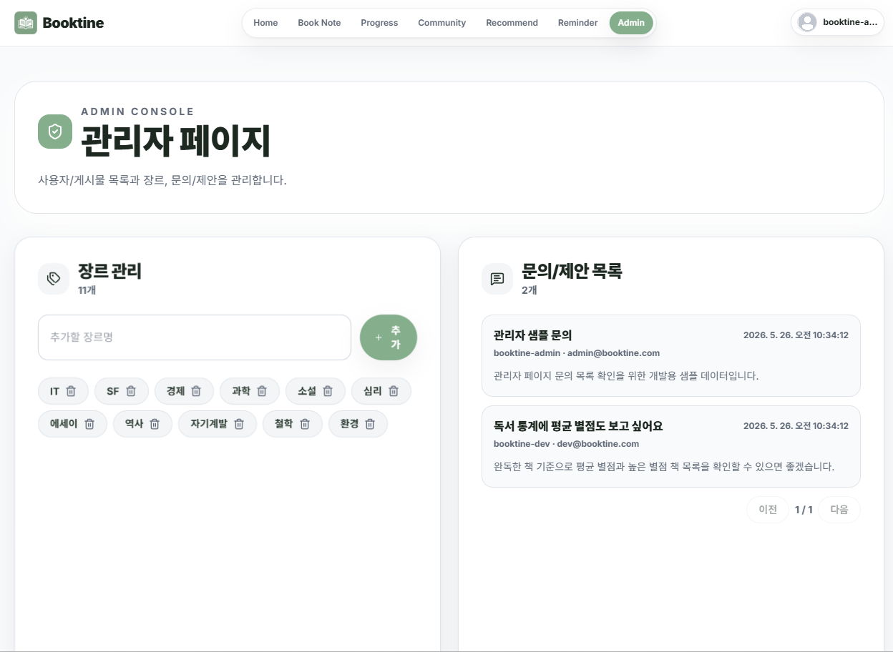 
      관리자
    </td>
    <td align="center">
      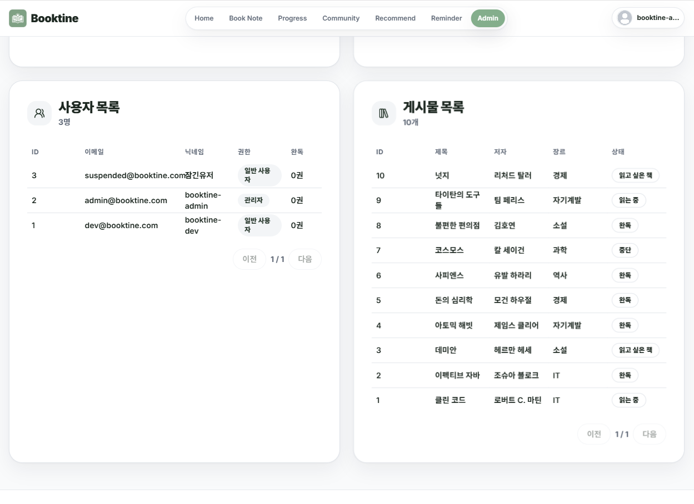 
      관리자
    </td>
  </tr>
</table>

관리자 권한으로 사용자, 게시글, 장르, 문의 목록을 조회하고 장르를 추가·삭제할 수 있습니다.

 

## 시스템 아키텍처

  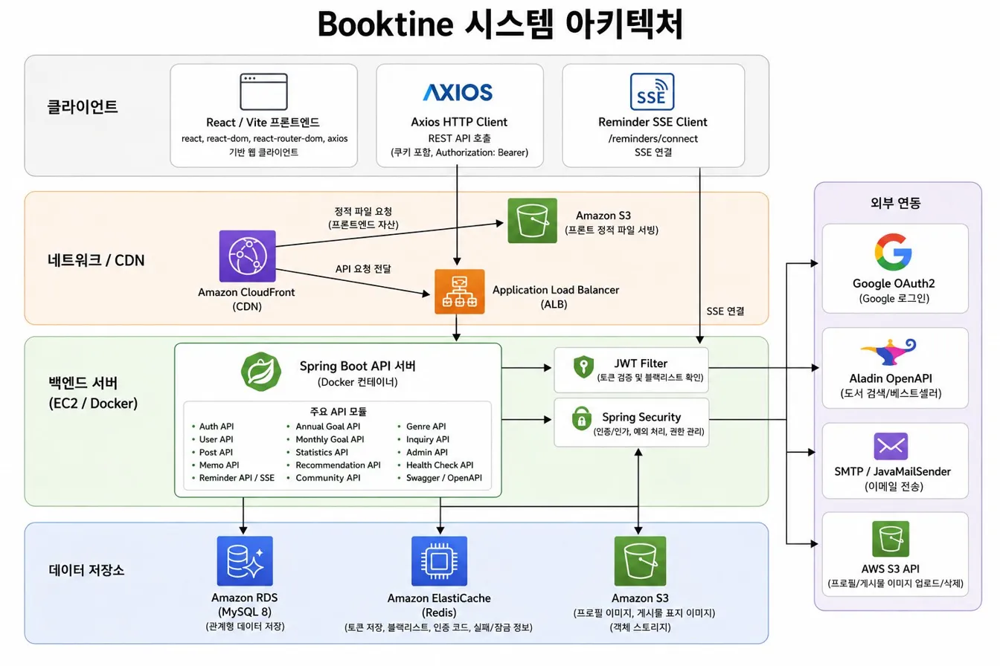

 

## ERD

  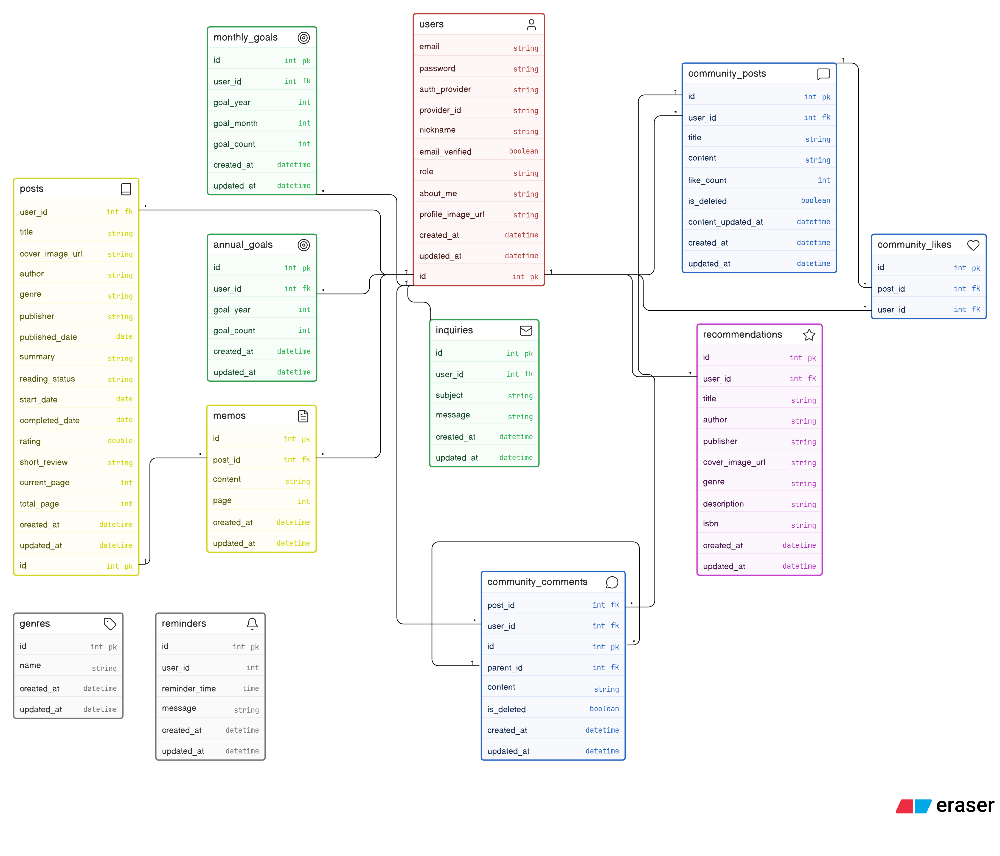

 

## 🛠 트러블슈팅

### 복합 인덱스 최적화
#### 실제 조회 패턴 분석을 통한 복합 인덱스 설계

독서 기록 조회 시 사용자 ID, 독서 상태, 완독일을 조건으로 사용하는 조회가 빈번하게 발생했다. 단일 인덱스로는 조회 패턴에 맞는 인덱스 활용이 불가능했고, 실제 조회에서도 인덱스가 제대로 활용되지 않는 것을 확인했다.

사용자별 독서 상태 기반 조회 복합 인덱스(사용자 ID → 독서 상태 → 완독일)와 완독 도서 조회 복합 인덱스(사용자 ID → 독서 상태)를 각각 설계했다. EXPLAIN ANALYZE로 인덱스 활용 여부를 직접 검증했다.

→ [블로그 상세 기록](https://dev-cloud.tistory.com/497)

### 단일 EC2 성능 한계 검증
#### k6 부하 테스트

단일 EC2 t2.micro 환경에서 서비스가 감당할 수 있는 동시 요청 수준을 확인할 명확한 기준이 없었다.

k6를 사용해 주요 API 시나리오를 구성하고 부하 테스트를 진행했다. 단일 EC2 환경에서 약 7 RPS 이상이면 P95 응답시간이 급격히 증가했고, 동시에 Like API에서 Race Condition이 발견됐다. 테스트를 통해 트래픽 임계점과 동시성 문제를 사전에 파악할 수 있었다.

→ [블로그 상세 기록](https://dev-cloud.tistory.com/509)

### N+1 문제 개선
#### fetch join / @EntityGraph 적용

게시글, 메모, 커뮤니티 게시글/댓글 조회 시 DTO 변환 과정에서 연관 엔티티에 접근할 때 지연 로딩으로 인해 결과 수만큼 추가 쿼리가 발생하는 구조였다.

- **게시글 검색** (`GET /posts/search`) — QueryDSL `.join(post.user).fetchJoin()`으로 `Post → User`를 한 번에 조회하도록 개선
- **게시글/메모/커뮤니티 게시글·댓글 목록 조회** — `@EntityGraph`를 적용해 DTO 변환 시 접근하는 `User`, `Post`, `Parent` 관계를 즉시 로딩으로 전환

## ♻️ 리팩토링

### AWS 아키텍처 단순화
#### 비용 효율을 고려한 단일 EC2 전환

초기 배포 환경은 ALB, RDS, ElastiCache를 각각 독립된 서비스로 구성했다. 서비스 규모에 비해 AWS 크레딧 소모가 빠르게 발생했다.

관리형 서비스 대신 단일 EC2에 MySQL과 Redis를 직접 설치하는 구조로 전환했다. Spring Boot는 Docker 컨테이너로, Nginx는 리버스 프록시로 구성했다. ALB·RDS·ElastiCache를 제거해 비용 요소를 줄이고, 단일 EC2 기준으로 서비스 전체가 영향을 받는 한계는 있지만 트래픽 규모와 목적에 맞춰 비용과 가용성 사이의 트레이드오프를 선택했다.

### 보안 점검
#### 인증/인가 및 실서비스 취약점 개선

기능 구현 완료 후 "실서비스 기준"으로 보안을 별도 점검했다. 주요 개선 내용은 다음과 같다.

- **공개 엔드포인트 범위 축소** — `/auth/**` 전체 허용에서 로그인·회원가입 등 꼭 필요한 경로만 허용으로 변경
- **JWT 블랙리스트** — 로그아웃 후 탈취된 토큰 재사용을 막기 위해 Redis에 `BL:{token}` 키로 저장, 이후 요청마다 검증
- **Brute-force 방어** — Redis로 로그인 실패 횟수 관리, 5회 초과 시 15분 잠금. 이메일 인증 코드도 동일하게 적용
- **민감 정보 로그 제거** — 로컬 개발용 인증 코드 로그 출력 코드가 운영에서도 실행될 수 있는 위치에 있어 제거
- **S3 업로드 검증** — MIME 타입(`image/jpeg`, `image/jpg`, `image/png`) 및 5MB 용량 제한 추가
- **입력값 검증 보완** — `@Valid` 누락된 API에 추가, DTO에 `@NotBlank`, `@Size`, `@Min`, `@Max` 보완

 

## 프로젝트 후기

### 느낀 점
1차 개발 코드를 다시 봤을 때 솔직히 당황했다. 
백엔드 개발자가 되고 싶다고 하면서 정작 프론트에 집중된 코드를 짜고 있었고, 구현 내내 수정의 반복이었다. 
결국 수정으로 해결할 수 있는 수준이 아니라고 판단해서 코드를 싹 밀고 처음부터 다시 시작했다.

배포도 마찬가지였다. 무료 플랫폼을 찾아 이리저리 옮겨다니다 보니 제대로 된 배포가 안 됐고,
CORS 에러 하나 때문에 두 달을 날리기도 했다. 
그 시행착오를 반복하지 않으려고 이번엔 AWS를 처음 써보면서 도메인도 직접 구매하고 Docker도 도입했다. 
덕분에 배포가 어떤 흐름으로 돌아가는지 처음으로 제대로 이해하게 됐고, 그만큼 신경 써야 할 것이 많다는 것도 몸으로 느꼈다.

코드도, 배포도 처음부터 다시 잡으면서 달라진 건 그것만이 아니었다.
백엔드 설계를 먼저 세세하게 잡고, 일정이랑 기능 우선순위까지 다 정하고 들어가니까
개발하는 데 막히는 게 없었고 훨씬 깊이 있게 만들어졌다.
규모가 작은 프로젝트인데도 도메인이 생각보다 훨씬 커져서 놀라기도 했다.
무엇보다 백엔드가 탄탄하게 구현되고 나니 프론트는 그에 맞춰 연결만 하면 됐고, 
그때 "백엔드를 잘 짜면 프론트가 편해진다"는 말이 무슨 의미인지 실감했다.

1차 개발 때랑 비교하면 나 자신이 굉장히 많이 성장했다는 걸 느낀다.
그때는 성능도, 보안도, N+1이 뭔지도 몰랐는데 이제는 그런 부분까지 직접 고민하고 적용해볼 수 있게 됐다.
이 프로젝트가 단순한 포트폴리오용 프로젝트가 아니라 나의 성장을 제대로 보여주는 프로젝트라고 생각하고,
나의 첫 프로젝트라 더 의미 있다.

### 아쉬운 점
개발 기간 후반으로 갈수록 뒷심이 떨어져서, 세세하게 짚고 넘어가야 할 부분들을 제대로 보지 못한 채 
마무리한 게 많았다. 그 영향이 배포 이후에 드러났다. 
이리저리 테스트하다 보니 사소한 문제들이 하나씩 나왔고, 
배포하고 나서도 계속 수정사항이 생기는 상황이 반복됐다. 
배포 전에 더 꼼꼼하게 검증했더라면 하는 아쉬움이 남는다.

### 향후 계획
부족한 기능들은 계속 추가할 예정이고, 보안 문제나 성능 문제, 동시성 처리, 
실제 가입자 수 같은 지표 등 실제 서비스 운영 관점에서 고려해야 할 것들을 하나씩 리팩토링해나갈 계획이다.

 

## 마치며

앞으로도 Booktine을 계속 발전시켜서 단순한 독서 기록을 넘어 
사람들이 독서 습관을 만들고 유지하는 데 실질적으로 도움이 되는 서비스로 만들어나갈 생각입니다.

